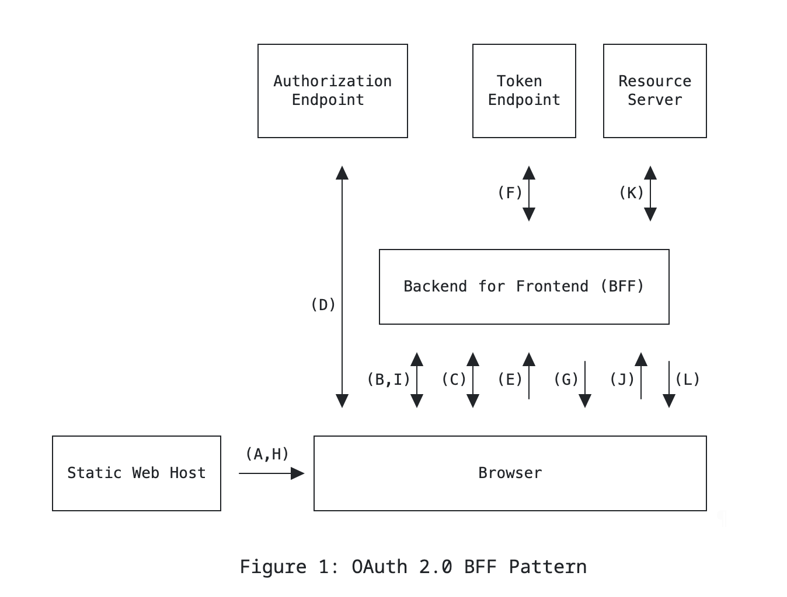

사이드 프로젝트를 하며 로그인 기능을 구현하게 되었다. 프로젝트 시작 전엔 자체 로그인 기능을 구상했다.
하지만 프로젝트 기간을 기획/디자인/개발을 포함해서 최대 5주로 잡았기 때문에, 자체 로그인을 구현하는 건 시간적으로 쉽지 않다는 판단을 내렸다. 로그인만 만들다가 끝날 수는 없다.
동시에 초반엔 기획과 디자인도 함께 해야 하는 상황이었고, 프로젝트를 위한 팀원 모집도 완료가 되지 않은 상태였다.

<!-- truncate -->

결과적으로, MVP에는 소셜 로그인 1개만 들어가게 되었다.
물론 이 과정에 팀원분들도 로그인에 공을 들이기 보다는, 주요 기능에 집중하는 게 맞다는 데 동의해 주셨다.
가장 많이 쓰는 소셜 로그인으로는 카톡/네이버/구글이 있었고, 사용자가 가장 접하기 쉬운 SNS를 선택 기준으로 삼았다.
그렇게 가장 유저 접근성이 좋다고 판단한, 카톡 로그인으로 구현하게 되었다.

근데 여기서 의문이 생겼다.
자체 로그인은 스펙이 커서 보류했지만, OAuth 방식의 로그인이 어떤 장점이 있길래 요즘 대부분의 서비스에서 OAuth를 사용하는 것일까?
물론 사용자 측에서는 편한 것은 알겠는데, 단순히 그 장점 하나 때문에 제공자 측에서 이 기능을 사용하는 것은 아닐 것 같았다.
그렇게 OAuth가 무엇인지 찾아보게 되었다.

## OAuth란

정의는 기본적으로 아래와 같았다.

> OAuth는 인터넷 사용자들이 패스워드를 제공하지 않고 다른 웹사이트 상의 자신들의 정보에 대해 웹사이트나 애플리케이션의 접근 권한을 부여할 수 있는 공통적인 수단으로서 사용되는, 접근 위임을 위한 개방형 표준이다.
>
> _- [Wikipedia OAuth](https://ko.wikipedia.org/wiki/OAuth)_

하지만 이 정의만으로는 OAuth를 이해하긴 어려웠다. 그래서 OAuth 문서([RFC 5849](https://datatracker.ietf.org/doc/html/rfc5849), [RFC 6749](https://datatracker.ietf.org/doc/html/rfc674))를 찾아보게 되었다.

## OAuth의 배경

<details open>
  <summary>[RFC 5849](https://datatracker.ietf.org/doc/html/rfc5849), [RFC 6749](https://datatracker.ietf.org/doc/html/rfc674) Introduction 요약</summary>

-   OAuth는 '특정 사용자의 데이터를 안전하게 활용할 수 있는 방법'으로 등장했다.
-   OAuth 모델은 사용자가 아이디와 패스워드를 직접 입력하지 않고도, 제한된 권한을 부여받아 안전하게 접근할 수 있는 방식을 제시한다.
-   기존 인증 방식은 사용자의 계정 정보를 서버에 직접 입력해야 했고, 이 부분에 보안 취약점이 있었다.
-   이런 문제를 해결하기 위해 OAuth는 기존 클라이언트-서버 인증 모델에 '리소스 소유자(Resource Owner)'라는 개념을 도입했다.
-   여기서 리소스 소유자는 인증 과정을 직접 수행하고, 애플리케이션에는 제한된 접근 권한을 주게 된다.
-   즉, OAuth의 주요 메커니즘은 사용자의 아이디와 패스워드를 직접 공유하는 대신 토큰을 사용하여 서버 자원에 안전하게 접근하도록 하는 것이다.
-   OAuth 1.0에서는 실무에서 확장성과 유지보수에 어려움이 있었고, 이를 개선한 OAuth 2.0이 도입되어 현재는 더 다양한 인증 시나리오를 지원하고 있다.

</details>

OAuth의 등장 이유는 당연하게도 기존 방식의 불편함이었다.
OAuth 이전 인증은 아이디와 패스워드를 사용자가 직접 입력하는 방식이었고, 이 방식에는 표준이 없었다.
또한, 서비스 제공자가 사용자의 패스워드를 직접 보관하기 때문에, 보안상 취약하고 계정 탈취 위험도 컸다.
OAuth는 이러한 문제를 해결하기 위해 등장한 표준화된 인증 방식이다.
사용자의 계정 정보를 직접 공유하지 않고도, 토큰을 사용하여 서버 자원에 안전하게 접근할 수 있도록 설계되었다.

## OAuth의 주요 개념 (Role)

| 이름                             | 내용                                                                                                                                       |
| -------------------------------- | ------------------------------------------------------------------------------------------------------------------------------------------ |
| Resource Owner (리소스 소유자)   | 보호된 리소스에 대한 접근을 승인할 수 있는 개체. 리소스의 원래 소유자이다. 일반적으로 이는 사용자를 의미한다.                              |
| Resource Server (리소스 서버)    | 제한된 리소스를 호스팅하는 서버. 사용자의 데이터를 저장하고 있는 곳으로, 클라이언트가 이 서버를 통해 데이터에 접근한다.                    |
| Client (클라이언트)              | 인가를 이용하여 리소스 소유자를 대신해 제한된 리소스 요청을 만드는 애플리케이션. 즉, 사용자의 리소스에 접근하려는 애플리케이션을 의미한다. |
| Authorization Server (인가 서버) | 리소스 소유자를 성공적으로 인증하고 인가를 얻은 뒤 클라이언트에게 접근 토큰을 발급하는 서버.                                               |

### 인증과 인가의 차이

그럼 인증과 인가는 무슨 차이일까.

인증이란 Authentication으로 쉽게 말해 '너 누구야'를 파악하는 것이다. 즉, 현재 페이지에 접속한 유저가 누구인지 확인하는 것을 의미한다.
인가란 Authorization으로 '어떤 유저(User)가, 어떤 리소스(Resource)에, 어떤 액션(Action)을 수행할 권한이 있는지 확인하는 것'이라고 할 수 있다.

주로 인증은 프론트엔드의 역할이고, 인가는 백엔드의 역할로 볼 수 있다.

## Authorization Code Flow


<!-- ```mermaid
sequenceDiagram
participant User as 사용자 (Resource Owner)
participant Client as 내 애플리케이션 (Client)
participant AuthServer as 인가 서버 (Authorization Server)
participant ResourceServer as 리소스 서버 (Resource Server)

User->>Client: 로그인 버튼 클릭
Client->>AuthServer: client_id, redirect_uri 포함하여 인증 요청
AuthServer->>User: 로그인 및 권한 부여 요청
User->>AuthServer: 로그인 및 정보 제공 동의
AuthServer->>Client: 인가 코드 발급 (redirect_uri로 리다이렉트)

Client->>AuthServer: client_id, client_secret, redirect_uri, 인가 코드 포함하여 Access Token 요청
AuthServer->>Client: Access Token 및 Refresh Token 발급

Client->>ResourceServer: Access Token 포함하여 데이터 요청
ResourceServer->>Client: 요청된 데이터 반환
``` -->

1. 사전 작업
    - 인가 서버(카카오)에 클라이언트(내 애플리케이션) 등록
    - 인가 서버는 클라이언트에 `client_id`, `client_secret` 을 발급
    - 클라이언트에서 허용할 `redirect_uri` 등록
2. 로그인 페이지로의 접근
    - 사용자가 클라이언트의 로그인 버튼 클릭 → 클라이언트는 쿼리 파라미터에 `client_id` 와 `redirect_uri` 를 담아, 인가 서버의 엔드포인트로 리다이렉트
    - 인가 서버는 `client_id`와 `redirect_uri`가 유효한지 체크하고, 사용자에게 로그인 및 권한 부여 화면(로그인 창)을 보여준다.
    - 사용자가 로그인 후 정보 제공에 동의하면, 인가 서버는 인가 코드를 발급해 `redirect_uri` 로 클라이언트에 반환 및 리다이렉트 시킨다.
3. 접근 토큰 요청
    - 클라이언트는 `client_id`, `client_secret`, `redirect_uri`, 인가 코드를 포함해 인가 서버의 토큰 엔드포인트로 토큰 요청
    - 인가 서버는 확인 후 Access Token 및 Refresh Token을 클라이언트에 반환한다
4. 사용자 인증 및 세션 유지
    - 클라이언트는 인가 서버의 Access Token을 저장
    - Access Token을 사용해 리소스 서버에서 데이터를 가져온다.

## 프로젝트에 적용해보기

OAuth 로그인 구현은 크게 2가지 방식이 있다.

1. 프론트 중심 방식 (프론트에서 Access Token 발급 후 전달)

    - 프론트에서 OAuth 카카오 인가 서버에 로그인 요청
    - 로그인 성공 후, Access Token을 프론트에서 직접 수신
    - 프론트는 받은 Access Token을 백엔드로 전달하여 회원가입 및 로그인 처리 요청
    - 백엔드는 이 Access Token을 이용해 OAuth Provider에서 사용자 정보를 조회

2. 백엔드 중심 방식 (백엔드에서 OAuth 2.0 플로우 처리)

    - 프론트는 단순히 백엔드의 OAuth 로그인 API를 호출
    - 백엔드가 OAuth 2.0 Provider로 리다이렉트
    - 인증 성공 후, Authorization Code를 백엔드에서 직접 받아 Access Token 요청
    - 백엔드에서 Access Token과 Refresh Token을 저장 및 관리
    - 프론트에는 세션 또는 자체 발급 JWT만 제공하여 인증 유지

### 잘못된 방식의 구현

초기 작업을 할 때 놓친 것이 있었다.
프론트엔드인 나는 1번 방식을 생각했고, 백엔드 분은 2번 방식을 생각한 것이다.
결과적으로 이 두가지 방식이 섞인 혼합된 로그인이 탄생했다.

3. 프백 혼합 방식의 탄생

    - 프론트에서 OAuth 카카오 인가 서버에 로그인 요청
    - 인증 성공 후, Authorization Code를 백엔드에서 직접 받아 Access Token 요청
    - 백엔드에서 Access Token과 Refresh Token을 발급 받음
    - 백엔드가 프론트로 리다이렉트 & URL에 Access Token 포함
    - 프론트가 API 요청 시 Access Token을 백엔드에 전달

<details>
  <summary>서버에서 리다이렉트를 해주면, 프론트에서 URL로 받는 Access Token과 Refresh Token</summary>

    
    
    

</details>

:::danger 발생한 문제점

-   URL을 통해 Access Token & Refresh Token이 그대로 노출
-   Refresh Token이 유출되면 장기적인 계정 탈취 가능
-   Refresh Token이 프론트에서 관리되면 XSS 공격에 취약해짐
-   프론트에서는 Access Token을 다루지 않고, JWT 또는 세션을 사용해야 함

:::

### 어떻게 개선해야 할까

우선 보안을 생각하면 2번 방식으로 진행하는게 맞다.
하지만 현재 프로젝트가 어느정도 완성된 상태이기 때문에, 처음부터 재설계를 하기는 어렵다.
기존 구조를 유지하며, 개선할 수 있는 최선의 방법을 구상해보았다.

구상 1.

-   프론트에서 카카오 로그인 페이지로 리다이렉트
-   카카오 인가 서버에서 인가 코드 발급 후 프론트로 리다이렉트
-   프론트에서 인가 코드를 추출 후 백엔드로 보내 Access Token 발급 요청
-   백엔드가 카카오 OAuth 서버에 Access Token 요청 및 수신
-   백엔드가 Access Token을 프론트에 반환
-   프론트는 Access Token을 저장하여 이후 API 요청에 사용

구상 2. HttpOnly Secure 쿠키 활용

-   프론트에서 카카오 로그인 페이지로 리다이렉트
-   카카오 인가 서버에서 인가 코드 발급 후 프론트로 리다이렉트
-   프론트에서 인가 코드를 추출 후 백엔드로 Access Token 발급 요청
-   백엔드가 카카오 OAuth 서버에 Access Token 요청 및 수신
-   백엔드가 Access Token과 Refresh Token을 HttpOnly Secure 쿠키에 저장하여 반환
-   프론트는 Access Token을 직접 다루지 않고, API 요청 시 자동으로 쿠키가 포함되어 인증 유지

더 나은 대안에 대해 여러 구상을 하던 중 Best Practice가 무엇일지 궁금해졌다.
분명 Best Practice가 있을 것 같았기 때문이다.
그렇게 구글링을 하던 중 PKCE(Proof Key for Code Exchange)라는 것을 알게 되었다.
찾아보니 PKCE는 OAuth 2.1에서는 필수로 권고되는 보안 확장이라고 한다. 그럼 PKCE란 무엇이길래 OAuth 2.1에서 필수로 권고되는 걸까?

## PKCE란 무엇인가

> PKCE was originally designed to protect the authorization code flow in mobile apps, and was later recommended to be used by single-page apps as well. In later years, it was recognized that its ability to prevent authorization code injection makes it useful for every type of OAuth client, even apps running on a web server that use a client secret. Because of its history in the use of mobile apps and single-page apps, it is sometimes incorrectly thought that PKCE is an alternative to a client secret. However PKCE is not a replacement for a client secret, and PKCE is recommended even if a client is using a client secret, since apps with a client secret are still susceptible to authorization code injection attacks.
>
> _- [Okta의 RFC7636 문서 요약](https://www.oauth.com/oauth2-servers/pkce/)_

PKCE("[pixy](https://datatracker.ietf.org/doc/html/rfc7636)"로 발음)는 원래 모바일 앱에서 인가 코드 흐름(Authorization Code Flow)을 보호하기 위해 설계되었고, 이후 싱글 페이지 애플리케이션(SPA)에서도 사용하도록 권장되었다.
그리고 몇 년 후 인가 코드 주입(Authorization Code Injection) 공격을 방지할 수 있다는 점에서 모든 유형의 OAuth 클라이언트에 유용하다는 사실이 확인된다.
심지어 Client Secret을 사용하는 웹 서버 기반 애플리케이션에서도 마찬가지이다.

PKCE가 모바일 앱과 SPA에서 먼저 사용되었기 때문에, 종종 Client Secret의 대안으로 오해받기도 한다.
하지만 PKCE는 Client Secret을 대체하는 개념이 아니다.
오히려 Client Secret을 사용하는 애플리케이션조차도 인가 코드 주입 공격에 취약할 수 있기 때문에, PKCE는 Client Secret을 사용하더라도 함께 적용하는 것이 권장된다.

예를 들면, 기존의 OAuth 방식엔 아래와 같은 인가 코드 주입 공격 시나리오가 생길 수 있다. ([RFC 9700 - 4.5. Authorization Code Injection](https://datatracker.ietf.org/doc/rfc9700))


<!-- ```mermaid
sequenceDiagram
    participant A as 공격자
    participant U as 피해자
    participant F as 프론트엔드
    participant B as 백엔드
    participant I as 인가 서버 (Authorization Server)

    U->>F: 1. 로그인 요청
    F->>I: 2. 인가 코드 요청 (정상적인 OAuth 플로우)
    I->>F: 3. 인가 코드 발급
    F->>B: 4. 인가 코드 전달 (백엔드로 전송)

    Note over A: 5. 인가 코드 탈취
    A->>B: 6. 탈취한 인가 코드로 Access Token 요청
    B->>I: 7. 백엔드가 인가 코드 검증 후 Access Token 요청 (client_secret 포함)
    I->>B: 8. Access Token 발급 (정상적인 인가 코드라 판단)
    B->>A: 9. 공격자의 Access Token 획득
    A->>B: 10. 공격자가 피해자의 계정으로 API 요청 (OAuth 인증 성공)
``` -->

인가 코드 주입 공격 시나리오

-   공격자가 피해자의 인가 코드(Authorization Code)를 탈취한다.
-   공격자는 탈취한 인가 코드를 이용해 백엔드로 요청을 보낸다.
-   백엔드는 정상적인 인가 코드라 판단하고, `client_secret`을 사용해 Access Token을 인가 서버로 요청한다.
-   결과적으로 공격자는 피해자의 계정으로 로그인 할 수 있게 된다.

즉, 인가 코드만 탈취하면 `client_secret`을 몰라도 정상적인 백엔드 서버를 이용해 Access Token을 받을 수 있는 것이다.
이때 PKCE를 사용하면 이러한 인가 코드 주입 공격을 방지할 수 있다고 한다. PKCE의 방식은 아래와 같다.


<!-- ```mermaid
sequenceDiagram
    participant Client as 내 애플리케이션 (Client)
    participant AuthServer as 인가 서버 (Authorization Server)

    Client->>Client: 1. code_verifier 생성
    Client->>Client: 2. code_verifier를 SHA-256 해싱 → code_challenge 생성
    Client->>AuthServer: 3. 로그인 요청 (client_id, redirect_uri, code_challenge, code_challenge_method)
    AuthServer->>AuthServer: 4. client_id, redirect_uri 유효성 검증
    AuthServer->>Client: 5. 로그인 페이지 표시
    Client->>AuthServer: 6. 사용자 로그인
    AuthServer->>Client: 7. redirect_uri로 인가 코드 전달
    Client->>AuthServer: 8. Access Token 요청 (인가 코드, code_verifier)
    AuthServer->>AuthServer: 9. code_verifier 해싱 → 로그인 요청시 받은 code_challenge와 일치 여부 확인
    AuthServer->>Client: 10. Access Token 반환
``` -->

구상 3. OAuth 2.0 + PKCE 적용

-   로그인 페이지로 접근한다.
-   랜덤한 문자를 생성하고 `code_verifier`라 한다.
-   `code_verifier`를 SHA-256 해싱한 뒤 `code_challenge`를 만든다.
-   로그인 요청을 보낼 때, 쿼리 파라미터에 `client_id`, `redirect_uri`, `code_challenge`, `code_challenge_method`를 담아서 인가 서버로 보낸다.
-   인가 서버는 `client_id`와 `redirect_uri`가 유효한지 확인하고, 유효하면 로그인 창을 띄운다.
-   사용자가 로그인하면, 인가 서버는 `redirect_uri`로 인가 코드(일회용)를 담아서 내 애플리케이션으로 리다이렉트한다.
-   내 애플리케이션에서 받은 인가 코드와 저장해 두었던 `code_verifier`를 인가 서버로 보내 Access Token을 요청한다.
-   인가 서버는 `code_verifier`를 같은 알고리즘으로 해싱하여, 인가 코드 생성 시 받은 `code_challenge`와 일치하는지 확인한다.
-   검증이 되면, 인가 서버가 Access Token을 반환한다.

한마디로 PKCE는 공격자에게 인가 코드를 탈취당했을 경우를 대비해 클라이언트와 인가 서버가 서로 동일한 문자열을 공유하며, 해당 문자열을 암호화한 값을 주고받으며 위조 및 탈취를 방지하는 것이다.

### BFF

프론트에서 Access Token을 유지하는 구상 3의 방식은 Refresh Token을 활용한 로그인 연장 기능이 없어, 사용자가 일정 시간이 지나면 다시 로그인을 해야 한다. 안전하고 지속적인 인증을 위해서는 Backend에서도 대응이 필요하지 않을까 하는 생각이 들었다.

언제나 그렇듯 RFC 문서는 영어로 되어있고, 너무 길고 불친절하다.
최대한 잘 설명된 다른 자료를 찾아보려고 했으나 생각보다 PKCE 관련된 좋은 자료 찾기가 쉽지 않다.
괜한 것을 파고 있는 것이 아닌가 싶다가도, 궁금하니까 계속 찾아보게 된다.
다시 원점으로 돌아와 [RFC 9700](https://datatracker.ietf.org/doc/rfc9700) 문서를 읽어보기로 했다.

이 문서는 제목부터 'Best Current Practice for OAuth 2.0 Security'이고, 2025년에 업데이트 된 최신 OAuth 2.0 보안 권장 사항을 담고 있다.
결론적으로 말하면, 아쉽게도 나는 이 문서를 100% 이해할 수는 없었다.
하지만 2. Best Practices의 번역본은 아래와 같이 남겨둔다. 물론 번역은 GPT를 이용했다.

<details>
  <summary>[번역] RFC 9700 Best Current Practice for OAuth 2.0 Security - 2. Best Practices </summary>

    2.  Best Practices

    본 섹션에서는 작성 시점에서 모범 사례로 간주되는 핵심 보안 메커니즘과 조치를 설명합니다. 이러한 보안 메커니즘 및 조치(자세한 공격 설명 포함)와 비교적 덜 사용되는 옵션에 대한 요구 사항은 4장에서 설명합니다.

    2.1.  Protecting Redirect-Based Flows

    클라이언트 리디렉션 URI를 사전 등록된 URI와 비교할 때, 인증 서버는 로컬호스트 리디렉션 URI의 포트 번호를 제외하고 정확한 문자열 매칭을 사용해야 합니다(4.1.3절 참조). 이 조치는 인증 코드 및 액세스 토큰의 유출을 방지하는 데 기여합니다(4.1절 참조). 또한 혼합 공격을 탐지하는 데 도움을 줄 수 있습니다(4.4절 참조).

    클라이언트와 인증 서버는 사용자의 브라우저를 임의의 URI로 전달하는 URL(오픈 리디렉터)을 노출해서는 안 됩니다(4.11절 참조). 오픈 리디렉터는 인증 코드 및 액세스 토큰의 유출을 초래할 수 있습니다.

    클라이언트는 교차 사이트 요청 위조(CSRF)를 방지해야 합니다. 여기서 CSRF는 인증 서버가 아닌 악의적인 제3자가 리디렉션 엔드포인트에 요청을 보내는 것을 의미합니다(자세한 내용은 RFC6819의 4.4.1.8절 참조). 인증 서버가 PKCE(Proof Key for Code Exchange, RFC7636)를 지원하는 것이 확인된 경우, 클라이언트는 PKCE에서 제공하는 CSRF 보호 기능을 사용할 수 있습니다. OpenID Connect 흐름에서는 nonce 매개변수가 CSRF 보호를 제공합니다. 그렇지 않은 경우, 사용자 에이전트와 안전하게 결합된 일회성 CSRF 토큰을 state 매개변수에 포함하여 CSRF를 방지해야 합니다(4.7.1절 참조).

    OAuth 클라이언트가 둘 이상의 인증 서버와 상호 작용할 수 있는 경우, 혼합 공격을 방어하는 것이 필수적입니다(4.4절 참조). 이를 위해 클라이언트는 다음과 같은 조치를 취해야 합니다.

    - [RFC9207]에 따라 iss 매개변수를 사용하거나,

    - ID 토큰의 iss 클레임([OpenID.Core] 또는 [OpenID.JARM] 응답)과 같은 인증 응답의 iss 값을 기반으로 한 대체 방안을 사용하여 이를 처리합니다([RFC9207] 참조).

    이러한 옵션이 없는 경우, 클라이언트는 인증 엔드포인트와 토큰 엔드포인트를 구별할 수 있도록 별도의 리디렉션 URI를 사용할 수도 있습니다(4.4.2절 참조).

    인증 서버가 사용자 자격 증명이 포함될 가능성이 있는 요청을 리디렉션할 때는 이러한 자격 증명이 실수로 전달되지 않도록 해야 합니다(4.12절 참조).

    2.1.1.  Authorization Code Grant

    클라이언트는 다음 옵션 중 하나를 사용하여 인증 코드 삽입 공격(4.5절 참조) 및 인증 코드 오용을 방지해야 합니다.

    - 공개 클라이언트는 반드시 PKCE(RFC7636)를 사용해야 합니다(4.5.3.1절 참조).

    - 기밀 클라이언트의 경우, PKCE(RFC7636) 사용이 권장됩니다. PKCE는 인증 코드의 오용 및 삽입을 강력하게 방지하며, 강력한 공격자가 있는 경우에도 CSRF를 방지할 수 있습니다(4.7.1절 참조).

    - 추가적인 예방 조치를 적용하면(4.5.3.2절 참조), 기밀 OpenID Connect([OpenID.Core]) 클라이언트는 nonce 매개변수와 ID 토큰 내 해당 클레임을 사용할 수도 있습니다.

    어떤 경우든, PKCE 챌린지 또는 OpenID Connect nonce는 반드시 트랜잭션별로 설정되어야 하며, 클라이언트 및 트랜잭션을 시작한 사용자 에이전트에 안전하게 결합되어야 합니다. 인증 서버는 PKCE 챌린지 또는 OpenID Connect nonce에 일정한 값을 사용하는 경우를 탐지하고 방지하는 것이 바람직합니다.

    참고: PKCE는 원래 네이티브 앱 보호를 위한 메커니즘으로 설계되었지만, 본 권고는 모든 유형의 OAuth 클라이언트(웹 애플리케이션 포함)에 적용됩니다.

    PKCE를 사용할 때 클라이언트는 PKCE 검증 값을 인증 요청에서 노출하지 않는 PKCE 코드 챌린지 방식을 사용해야 합니다. 그렇지 않으면 공격자가 인증 요청을 읽을 수 있는 경우(PKCE의 보안을 무력화할 수 있는 A4 유형 공격자, 3절 참조), 보호 메커니즘이 무력화됩니다. 현재 S256 방식만이 이러한 요구 사항을 충족합니다.

    인증 서버는 PKCE(RFC7636)를 지원해야 합니다.

    클라이언트가 유효한 PKCE code_challenge 매개변수를 인증 요청에서 전송하면, 인증 서버는 token 엔드포인트에서 올바른 code_verifier 사용을 강제해야 합니다.

    인증 서버는 PKCE 다운그레이드 공격을 방지하기 위해, code_verifier 매개변수를 포함한 토큰 요청이 유효하려면 인증 요청 시 code_challenge 매개변수가 반드시 존재해야 함을 보장해야 합니다(4.8.2절 참조).

    인증 서버는 PKCE 지원 여부를 감지할 방법을 제공해야 합니다. 이를 위해, 인증 서버는 Authorization Server Metadata([RFC8414])에서 지원하는 PKCE 챌린지 방식을 표시하는 code_challenge_methods_supported 요소를 게시하는 것이 권장됩니다. 인증 서버는 또한 특정 배포 환경에 따라 PKCE 지원을 보장하거나 확인할 수 있는 방법을 제공할 수도 있습니다.

    2.1.2.  Implicit Grant

    암시적 부여 방식(응답 유형 token)과 인증 서버가 인증 응답에서 액세스 토큰을 발급하는 기타 응답 유형은 액세스 토큰 유출 및 액세스 토큰 재사용 공격에 취약합니다(4.1, 4.2, 4.3, 4.6절 참조).

    또한, 인증 응답에서 발급된 액세스 토큰을 특정 클라이언트에 바인딩할 표준화된 방법이 존재하지 않습니다(2.2절 권장 사항 참조). 이는 공격자가 유출되거나 탈취된 액세스 토큰을 리소스 엔드포인트에서 사용할 수 있음을 의미합니다.

    이러한 문제를 피하기 위해, 클라이언트는 액세스 토큰이 인증 응답에서 발급되지 않도록 암시적 부여 방식(response type token) 또는 유사한 응답 유형을 사용하지 않아야 합니다. 만약 사용해야 한다면, 액세스 토큰 삽입을 방지하고 앞서 언급된 토큰 유출 벡터를 완화해야 합니다.

    대신, 클라이언트는 코드 응답 유형(즉, 인증 코드 부여 방식, 2.1.1절 참조) 또는 액세스 토큰이 토큰 응답에서 발급되는 다른 응답 유형(예: code id_token 응답 유형)을 사용해야 합니다. 이를 통해 인증 서버는 공격자의 재사용 시도를 감지할 수 있으며, 액세스 토큰이 URL에 노출되지 않기 때문에 공격 표면이 줄어듭니다. 또한, 인증 서버가 발급된 토큰을 특정 클라이언트에 바인딩할 수 있도록 지원합니다(2.2절 참조).

    2.2.  Token Replay Prevention

    2.2.1.  Access Tokens

    송신자 제약 액세스 토큰(sender-constrained access token)은 특정 송신자로 액세스 토큰의 적용 범위를 제한합니다. 해당 송신자는 리소스 서버에서 해당 토큰이 수락되기 위한 전제 조건으로 특정 비밀을 입증해야 합니다.

    인증 서버 및 리소스 서버는 OAuth 2.0 상호 TLS(RFC8705) 또는 OAuth 2.0 Demonstrating Proof of Possession(DPoP, RFC9449, 4.10.1절 참조)과 같은 메커니즘을 사용하여 액세스 토큰을 송신자 제약 방식으로 적용해야 하며, 이를 통해 탈취된 액세스 토큰의 오용을 방지해야 합니다.


    2.2.2.  Refresh Tokens

    공개 클라이언트의 리프레시 토큰은 반드시 송신자 제약을 적용하거나 리프레시 토큰 회전을 사용해야 합니다(4.14절 참조). RFC6749에 따르면, 기밀 클라이언트의 경우 리프레시 토큰은 발급된 클라이언트만 사용할 수 있습니다.

    2.3.  Access Token Privilege Restriction

    액세스 토큰과 연관된 권한은 특정 애플리케이션이나 사용 사례에 필요한 최소한의 권한으로 제한해야 합니다. 이를 통해 클라이언트가 리소스 소유자가 승인한 권한을 초과하여 사용하는 것을 방지할 수 있으며, 또한 사용자가 해당 보안 정책에서 허용된 권한을 초과하여 사용하는 것을 방지할 수 있습니다. 또한 액세스 토큰 유출 시 피해를 최소화할 수 있습니다.

    특히, 액세스 토큰은 특정 리소스 서버 또는 소수의 리소스 서버에만 유효하도록 제한해야 합니다. 이를 위해, 인증 서버는 액세스 토큰을 특정 리소스 서버와 연관시키며, 모든 리소스 서버는 요청을 받을 때마다 해당 액세스 토큰이 자신을 위해 발급된 것인지 검증해야 합니다. 검증 결과가 올바르지 않으면 요청을 거부해야 합니다. 이를 구현하기 위해, aud 클레임(RFC9068 참조)을 사용하여 액세스 토큰을 특정 리소스 서버에 제한할 수 있습니다. 또한, 클라이언트와 인증 서버는 scope 또는 resource 매개변수(RFC6749 및 RFC8707 참조)를 사용하여 액세스하려는 리소스 서버를 결정할 수 있습니다.

    추가적으로, 액세스 토큰은 특정 리소스 및 리소스 서버의 특정 작업에 대해서만 사용 가능하도록 제한해야 합니다. 이를 구현하기 위해, 인증 서버는 액세스 토큰을 해당 리소스 및 작업과 연관시키며, 리소스 서버는 각 요청을 수락하기 전에 액세스 토큰이 해당 리소스 및 작업에 대해 유효한지 확인해야 합니다. 클라이언트와 인증 서버는 scope 매개변수(RFC6749 참조) 및 authorization_details 매개변수(RFC9396 참조)를 사용하여 해당 리소스 및 작업을 결정할 수 있습니다.

    2.4.  Resource Owner Password Credentials Grant

    리소스 소유자 비밀번호 인증 방식(RFC6749)은 사용해서는 안 됩니다. 이 방식은 리소스 소유자의 자격 증명을 클라이언트에게 직접 노출시키므로 보안에 취약합니다. 설령 클라이언트가 신뢰할 수 있는 경우라도, 이 방식의 사용은 공격 표면을 증가시키며(즉, 자격 증명이 인증 서버뿐만 아니라 다른 위치에서도 유출될 가능성이 있음), 사용자가 인증 서버 이외의 위치에서 자격 증명을 입력하도록 유도하는 결과를 초래할 수 있습니다.

    또한, 리소스 소유자 비밀번호 인증 방식은 이중 인증이나 여러 단계의 사용자 상호작용을 요구하는 인증 프로세스와 호환되지 않습니다. WebCrypto(W3C.WebCrypto)나 WebAuthn(W3C.WebAuthn)과 같은 암호화된 자격 증명을 사용하는 인증 방식은 이 인증 유형과 함께 구현이 불가능할 수도 있습니다. 이는 보통 특정 웹 원본에 종속되기 때문입니다.

    2.5.  Client Authentication

    인증 서버는 클라이언트에 대한 자격 증명 발급/등록 프로세스를 수립하고, 해당 자격 증명의 기밀성을 유지할 수 있는 경우, 클라이언트 인증을 강제해야 합니다.

    클라이언트 인증을 위해 비대칭 암호화 기법을 사용하는 것이 권장됩니다. 예를 들어, OAuth 2.0을 위한 상호 TLS(RFC8705) 또는 서명된 JWT("Private Key JWT", RFC7521 및 RFC7523 준수) 방식이 있습니다. 후자는 OpenID.Core에서 private_key_jwt 클라이언트 인증 방식으로 정의됩니다. 비대칭 암호화 기반 클라이언트 인증을 사용하면, 인증 서버는 민감한 대칭 키를 저장할 필요가 없어, 키 유출에 대한 보안성이 더 높아집니다.


    2.6.  Other Recommendations

    OAuth 인증 서버 메타데이터(RFC8414)를 사용하면 OAuth 배포의 보안을 개선하는 데 도움이 될 수 있습니다.

    - 이를 통해 보안 기능 및 기타 새로운 OAuth 기능을 호환 가능한 소프트웨어 라이브러리가 자동으로 활성화할 수 있습니다.

    - 잘못된 설정의 가능성을 줄일 수 있습니다. 예를 들어, 공격자가 소유한 잘못된 엔드포인트 URL을 설정하거나 보안 기능을 잘못 구성하는 문제를 방지할 수 있습니다.

    - 암호화 키의 순환을 원활하게 하고 암호화 유연성을 보장하는 데 기여할 수 있습니다.

    따라서 인증 서버는 RFC8414에 따라 OAuth 인증 서버 메타데이터를 게시하는 것이 권장되며, 클라이언트는 이를 이용하여(사용 가능할 경우) 자체 구성을 자동화해야 합니다.

    4.15.1절에서 설명한 조건에 따라, 인증 서버는 클라이언트가 client_id 또는 진정한 리소스 소유자와 혼동될 수 있는 기타 클레임을 조작하지 못하도록 해야 합니다.

    클라이언트와 리소스 서버 간의 통신에서는 BCP195에 따른 종단 간 TLS 사용이 권장됩니다. TLS 트래픽을 중개 서버에서 종료해야 하는 경우, 추가 보안 권장 사항은 4.13절을 참조하십시오.

    인증 응답은 암호화되지 않은 네트워크 연결을 통해 전송되어서는 안 됩니다. 이를 위해, 인증 서버는 http 스킴을 사용하는 리디렉션 URI를 허용해서는 안 됩니다. 단, 네이티브 클라이언트가 RFC8252의 7.3절에서 설명한 대로 루프백 인터페이스 리디렉션을 사용하는 경우는 예외입니다.

    인증 응답이 HTTP 리디렉션 대신 postMessage(WHATWG.postmessage_api)와 같은 브라우저 내 통신 기술을 통해 전송되는 경우, 메시지를 보내는 측과 받는 측을 4.17절에서 설명한 대로 엄격하게 검증해야 합니다.

    브라우저 기반 클라이언트를 지원하기 위해, 클라이언트가 직접 액세스하는 엔드포인트(예: 토큰 엔드포인트, 인증 서버 메타데이터 엔드포인트, jwks_uri 엔드포인트, 동적 클라이언트 등록 엔드포인트)는 CORS(WHATWG.CORS)를 지원할 수 있습니다. 그러나 인증 엔드포인트에서는 CORS를 지원해서는 안 됩니다. 클라이언트는 이 엔드포인트에 직접 접근하는 것이 아니라, 사용자 에이전트를 이를 통해 리디렉션하기 때문입니다.

</details>

이 번역본은 다른 자료와 교차 검증하는 용도로 활용해 볼 예정이다.
기본적으로 공식 문서 이외의 자료에 대한 불신이 있는 편이라, 꼭 이렇게 교차 검증을 해야 안심이 된다.
그렇게 눈뜬장님이 된 기분을 뒤로하고 다른 자료를 찾아 나섰다.
이번에 선택한 키워드는 PKCE 그리고 Backend이다.

> The combination of Authorization Code Flow with PKCE and the Backend for Frontend (BFF) pattern represents the most secure approach available as of 2024.
>
> _- [Authorization Code Flow with PKCE and BFF](https://docs.abblix.com/docs/openid-connect-flows-explained-simply-from-implicit-flows-to-authorization-code-flows-with-pkce-and-bff#authorization-code-flow-with-pkce-and-bff)_

그리고 위와 같은 글을 발견했다.
PKCE에 BFF를 적용해 보안을 강화하는 방법에 관한 내용이다.
2024년 기준으로 가장 안전한 방법이라고 한다.
PKCE에 BFF 패턴을 적용하는 방법에 대한 [공식 문서](https://datatracker.ietf.org/doc/html/draft-ietf-oauth-browser-based-apps#section-6.1)가 있었다.

<details>
    <summary>[번역] OAuth 2.0 for Browser-Based Applications - 6.1 BFF</summary>

        6.1. Backend For Frontend (BFF)

        이 섹션에서는 모든 OAuth 작업과 API 상호작용을 처리하는 백엔드 컴포넌트에 의존하는 JavaScript 애플리케이션 아키텍처를 설명합니다.
        BFF(Backend For Frontend)는 세 가지 핵심 역할을 수행합니다.

        1. BFF는 기밀 OAuth 클라이언트(confidential OAuth client)로서 인가 서버와 상호작용한다.
        2. BFF는 OAuth 액세스 토큰 및 리프레시 토큰을 쿠키 기반 세션에서 관리하여, JavaScript 애플리케이션에 직접 노출되지 않도록 한다.
        3. BFF는 모든 리소스 서버 요청을 프록시하며, 올바른 액세스 토큰을 추가한 후 리소스 서버로 전달한다.

        이 아키텍처에서 BFF는 서버 측 컴포넌트로 동작하지만, 프론트엔드 애플리케이션의 일부입니다.
        API 게이트웨이(API Gateway)나 리버스 프록시(Reverse Proxy)와 같은 다른 아키텍처 개념과 혼동하지 않도록 주의해야 합니다.
        즉, BFF는 프론트엔드 애플리케이션을 위한 OAuth 클라이언트 역할을 수행합니다.

        ---

        만약 공격자가 JavaScript 애플리케이션 내에서 악성 코드를 실행할 수 있다면, 이 아키텍처는 이전에 논의된 대부분의 공격 시나리오를 견뎌낼 수 있습니다.
        BFF에서만 토큰을 관리하므로, JavaScript 환경에서 토큰을 직접 추출하는 것이 불가능합니다.
        (Single-Execution Token Theft(5.1.1절) 및 Persistent Token Theft(5.1.2절) 방지)

        또한 BFF는 기밀 클라이언트(confidential client)이므로,
        공격자가 브라우저 내에서 새로운 인증 흐름을 실행하는 것을 방지할 수 있습니다.
        (Acquisition and Extraction of New Tokens(5.1.3절) 방지)

        하지만 악성 JavaScript 코드가 여전히 애플리케이션의 동일한 오리진(origin)에서 실행되기 때문에,
        공격자는 사용자의 브라우저에서 BFF로 요청을 보낼 수 있습니다.
        (Proxying Requests via the User's Browser(5.1.4절))

        그러나, HttpOnly 쿠키를 사용하면 공격자가 세션 상태(session state)에 직접 접근할 수 없으며,
        이를 통해 클라이언트 하이재킹(Client Hijacking)에서 세션 하이재킹(Session Hijacking)으로의 확산을 방지할 수 있습니다.

</details>

:::tip BFF(Backend For Frontend)란?

BFF란 Backend For Frontend의 줄임말로, 프론트엔드에 표현될 데이터를 위한 백엔드 즉, 프론트엔드 데이터에 대한 책임을 백엔드가 가진다는 것을 의미합니다. 백엔드는 당연히 프론트엔드에 표현되는 데이터를 제공하니, 기존 방식과 BFF가 무엇이 다른지 아직은 감이 안 오실 텐데요. BFF는 단순히 데이터를 제공하는 것에서 나아가 프론트엔드 친화적으로 데이터를 제공합니다.

[BFF - kakaopay tech blog](https://tech.kakaopay.com/post/bff_webflux_coroutine/)

:::

그리고 윗글에서 언급한 내용을 기반으로 BFF를 적용한 안전한 방법을 구상 4로 정리해 보았다.



구상 4. OAuth 2.0 + PKCE 적용 + Backend for Frontend(BFF) = Best Practices?

-   로그인 페이지로 접근한다.
-   랜덤한 문자를 생성하고 `code_verifier`라 한다.
-   `code_verifier`를 SHA-256 해싱한 뒤 `code_challenge`를 만든다.
-   CSRF 방지를 위해 `state` 값을 생성하고 저장한다.
-   로그인 요청을 보낼 때, 쿼리 파라미터에 `client_id`, `redirect_uri`, `code_challenge`, `code_challenge_method`, `state`를 담아서 인가 서버로 보낸다.
-   인가 서버는 `client_id`와 `redirect_uri`가 유효한지 확인하고, 유효하면 로그인 창을 띄운다.
-   사용자가 로그인하면, 인가 서버는 `redirect_uri`로 인가 코드(일회용)와 함께 `state` 값을 담아서 내 애플리케이션으로 리다이렉트한다.
-   내 애플리케이션은 받은 `state` 값을 검증하여 CSRF 공격을 방지한다.
-   내 애플리케이션에서 받은 인가 코드와 저장해 둔 `code_verifier`, `client_id`, `client_secret`, `redirect_uri`를 인가 서버로 보내 Access Token을 요청한다.
-   인가 서버는 `code_verifier`를 같은 알고리즘으로 해싱하여, 인가 코드 생성 시 받은 `code_challenge`와 일치하는지 확인한다.
-   검증이 되면, 인가 서버는 Access Token과 Refresh Token을 함께 반환한다.
-   백엔드(BFF)에서 Access Token을 안전하게 저장하고, 프론트엔드에는 노출하지 않는다.
-   프론트엔드에서 보호된 리소스를 요청하면, 백엔드(BFF)는 Access Token을 담아 리소스 서버에 요청을 보낸다.
-   리소스 서버는 Access Token의 `aud` 클레임을 사용하여 해당 리소스 서버용으로 발급된 토큰인지 확인한다.
-   검증이 완료되면, 리소스 서버가 보호된 데이터를 반환한다.
-   Access Token이 만료되면, 백엔드(BFF)는 Refresh Token을 이용하여 새로운 Access Token을 요청한다.
-   Refresh Token Rotation(RTR)을 적용하여, 기존 Refresh Token이 재사용되지 않도록 한다.

구상 4의 보안 강화 효과 (+ 교차 검증)

-   인가 코드 탈취 방지 (PKCE)
    > 공개 클라이언트는 반드시 PKCE(RFC7636)를 사용해야 합니다(4.5.3.1절 참조). 기밀 클라이언트의 경우, PKCE(RFC7636) 사용이 권장됩니다. PKCE는 인증 코드의 오용 및 삽입을 강력하게 방지하며, 강력한 공격자가 있는 경우에도 CSRF를 방지할 수 있습니다(4.7.1절 참조).
-   Access Token을 프론트엔드에 노출하지 않음 (BFF)
    > 액세스 토큰을 송신자 제약 방식으로 적용해야 하며, 이를 통해 탈취된 액세스 토큰의 오용을 방지해야 합니다.
-   CSRF 공격 방지 (state 값 사용)
    > 클라이언트는 교차 사이트 요청 위조(CSRF)를 방지해야 합니다. 여기서 CSRF는 인증 서버가 아닌 악의적인 제3자가 리디렉션 엔드포인트에 요청을 보내는 것을 의미합니다(자세한 내용은 RFC6819의 4.4.1.8절 참조). 인증 서버가 PKCE(Proof Key for Code Exchange, RFC7636)를 지원하는 것이 확인된 경우, 클라이언트는 PKCE에서 제공하는 CSRF 보호 기능을 사용할 수 있습니다. OpenID Connect 흐름에서는 nonce 매개변수가 CSRF 보호를 제공합니다. 그렇지 않은 경우, 사용자 에이전트와 안전하게 결합된 일회성 CSRF 토큰을 state 매개변수에 포함하여 CSRF를 방지해야 합니다.
    <details>
    <summary>`state`와 `code_challenge` 비교</summary>
    | 매개변수                           | 정의                                                                | 목적                |
        | ---------------------------------- | ------------------------------------------------------------------- | ------------------- |
        | state                           | Client가 인증 서버에 보내는 인증 요청에 포함된 임의로 생성된 값 | CSRF 공격 방지      |
        | code_challenge (code_verifier) | code_verifier를 해싱하거나 변환하여 생성된 값                       | 인가 코드 탈취 방지 |
    </details>
-   Refresh Token 탈취 및 재사용 공격 방지 (RTR)
    > 공개 클라이언트의 리프레시 토큰은 반드시 송신자 제약을 적용하거나 리프레시 토큰 회전(RTR)을 사용해야 합니다(4.14절 참조). RFC6749에 따르면, 기밀 클라이언트의 경우 리프레시 토큰은 발급된 클라이언트만 사용할 수 있습니다.

<br/>
<br/>
<br/>

:::note 참고

-   [OAuth 2.0 아키텍처 이해와 보안 취약점 사례](https://www.igloo.co.kr/security-information/spring-security-part2-oauth-2-0-%EC%95%84%ED%82%A4%ED%85%8D%EC%B2%98-%EC%9D%B4%ED%95%B4%EC%99%80-%EB%B3%B4%EC%95%88-%EC%B7%A8%EC%95%BD%EC%A0%90-%EC%82%AC%EB%A1%80)
-   [PKCE: OAuth를 더욱더 안전하게 만드는 방법](https://devocean.sk.com/blog/techBoardDetail.do?ID=166255&boardType=techBlog)
-   [Leaking authorization codes and access tokens](https://portswigger.net/web-security/oauth#leaking-authorization-codes-and-access-tokens)
-   [PKCE: What and Why? - Authorization code flow](https://dropbox.tech/developers/pkce--what-and-why-)
-   [Authorization Code Flow with PKCE](https://auth0.com/docs/get-started/authentication-and-authorization-flow/authorization-code-flow-with-pkce)
-   [PKCE Mechanism](https://cheatsheetseries.owasp.org/cheatsheets/OAuth2_Cheat_Sheet#pkce-proof-key-for-code-exchange-mechanism)
-   [Best practice on Securing code_verifier in PKCE](https://stackoverflow.com/questions/67517436/best-practice-on-securing-code-verifier-in-pkce-enhanced-authorization-code-flow)
-   [FISA Seminar - PKCE](https://www.slideshare.net/slideshow/fisa-1-oauth2-0-jwt/269561947#34)
-   [OAuth 2.0 Auth Code Injection Attack in Action - Oktadev](https://www.youtube.com/watch?v=1ot45WwQWJE)
-   [간단한 OAuth 보안 재확인 - State](https://blog.logto.io/ko/oauth-security-recap)
-   [OAuth 2.0에서 PKCE의 목적과 보안 효과](https://blog.pages.kr/3183)
-   [The Back-end for Front-end Pattern (BFF)](https://philcalcado.com/2015/09/18/the_back_end_for_front_end_pattern_bff.html)
-   [OAuth 2.0 for Browser-Based Applications](https://datatracker.ietf.org/doc/html/draft-ietf-oauth-browser-based-apps#section-6.1)
-   [The Backend for Frontend Pattern](https://auth0.com/blog/the-backend-for-frontend-pattern-bff/)

:::
